# Create, build, and test a backend application with a database using Microsoft Azure and Azure DevOps

## Intro

In this tech demo we're going to be using Microsoft Azure and Azure DevOps to create, test and build a CRUD API Node.js backend application that talks to a MySql database. This has been developed on a Windows machine leveraging Windows Subsystem for Linux (Ubuntu WSL v2 specifically) and Homebrew but the steps are similar on MacOS and Linux systems.

We're also assuming you already have an Azure account, Git, Node.js, MySql and Docker configured correctly on your machine.

## Tech stack

- [Express] is one of the most popular web frameworks for Node.js that supports routing, middleware, view system etc. 
- [Sequelize] is a promise-based Node.js ORM that supports the dialects of most database systems out there. 
- [Docker] provides lightweight containers to run services in isolation from our infrastructure so we can deliver software quickly. 
- [Mocha] and [Chai] will be our framework and assertion library of choice when it comes to unit testing our app.
- [Azure DevOps] is what we're going to be using to store our code, build our app, push containers and everything infrastructure-related.

## Creating a Node.js app with Express, MySql and Sequelize

In this first section we're going to create our app so let's get right into it. 

## Create a repo, clone it and initialize the project

First things first: we're going to create a repository to store our code in Azure DevOps. You can use GitHub or any other version control system for this as well, but for this tech demo we're going to be focusing on Microsoft's tooling.

Go to [Azure DevOps] and create your project.
-  
- 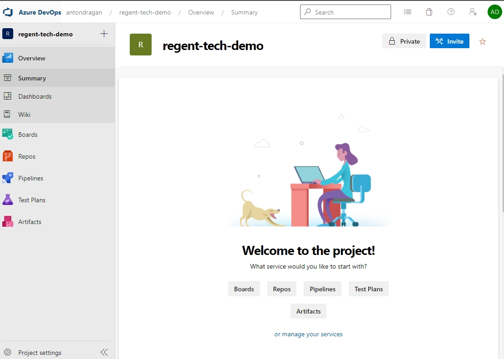

Click on `Repos` and `Generate Git Credentials`.
- 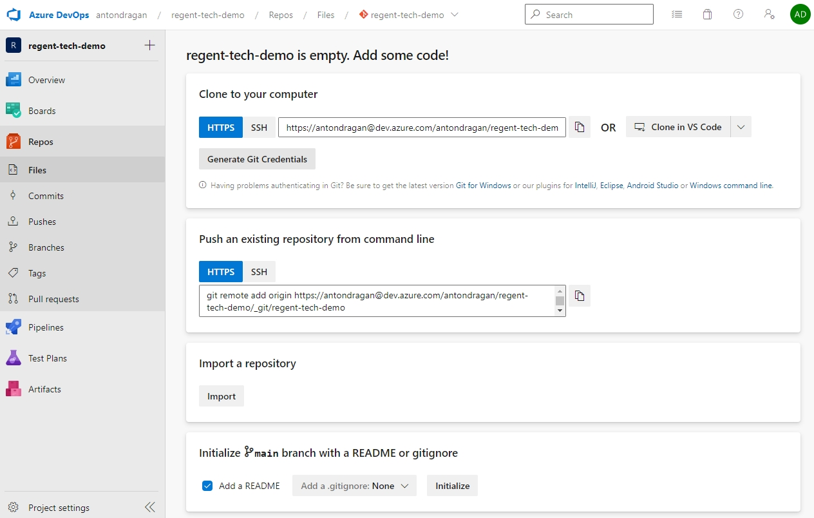

Clone the repo and provide the password given there .
- 

Change directory to the recently-cloned repo directory and run `npm init` .
- 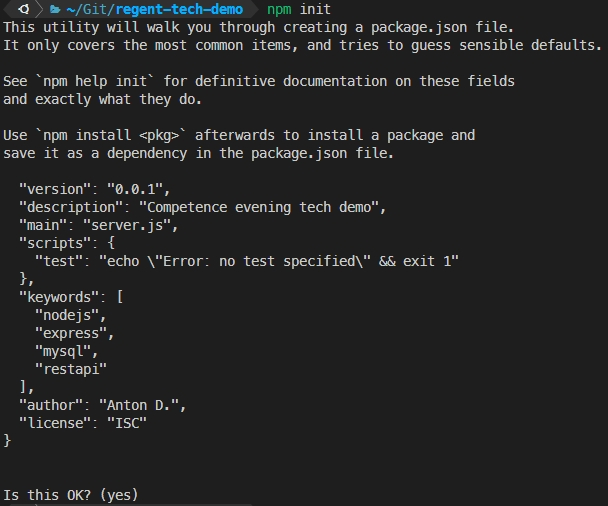

We need to install necessary modules: *express*, *sequelize*, *mysql2* and *cors*. Run: `npm install express sequelize mysql2 cors`

The package.json file should now look like this:
```json
{
  "name": "regent-tech-demo",
  "description": "Regent tech demo",
  "version": "1.0.0",
  "license": "ISC",
  "private": true,
  "main": "src/server.js",
  "scripts": {
    "start": "node src/server.js"
  },
  "dependencies": {
    "cors": "^2.8.5",
    "express": "^4.18.1",
    "mysql2": "^2.3.3",
    "sequelize": "^6.21.6"
  }
}
```

### Node.js REST CRUD API application overview

We will build REST API that can create, retrieve, update, delete and find consultants by specific skills.

First, we start with an Express web server. Next, we add configuration for MySQL database, create the consultant model with Sequelize, write the controller. Then we define routes for handling all CRUD operations (including custom finder).

The following table shows overview of the Rest APIs that will be exported:

|Methods|URLs|Actions|
|-|-|-|
|GET|api/consultants|get all consultants|
|GET|api/consultants/assigned|get all assigned consultants|
|POST|api/consultants|add new consultant|
|POST|api/consultants/skills|get all consultants by skills|
|PUT|api/consultants/update/:id|update consultant by id|
|DELETE|api/consultants/delete/:id|remove consultant by id|
|DELETE|api/consultants|remove all consultants|

Finally, we’re going to test the REST APIs using Postman.

### Setup Express web server

In the root folder of our repo, let’s create a new directory `src` and there we will create a `server.js` file:

```js
const express = require("express")
const cors = require("cors")

const app = express()

var corsOptions = {
  origin: "http://localhost:8081"
}

app.use(cors(corsOptions))

// parse requests of content-type - application/json
app.use(express.json())

// parse requests of content-type - application/x-www-form-urlencoded
app.use(express.urlencoded({ extended: true }))

// simple route
app.get("/", (req, res) => {
  res.json({ message: "Welcome to our Regent tech demo 🎉🎉🎉" });
})

app.use((req, res) => {
  res.status(404).json({ error: 'Route not found' })
})

// set port, listen for requests
const PORT = process.env.PORT || 8080;

const server = app.listen(PORT, () => {
  console.log(`Server is running on http://localhost:${PORT}`)
})

module.exports = server
```

What we are doing:
 - importing `express`, and `cors` modules
 - creating an Express app, then addding body-parser (`json` and `urlencoded`) and `cors` middlewares using the `app.use()` method; notice that we set the origin to: `http://localhost:8081`
 - defining a GET route which is simple for test
 - defining a basic 404 route
 - listening on port `8080` for incoming requests

### Configure MySQL database & Sequelize

In the `src` folder we will create a separate config directory for configuration: `src/config/db.config.js` that will look like this:
```js
module.exports = {
  HOST: "localhost",
  USER: "root",
  PASSWORD: "12345678",
  DB: "consultantsdb",
  dialect: "mysql",
  pool: {
    max: 5,
    min: 0,
    acquire: 30000,
    idle: 10000
  }
}
```

First five parameters are for the MySQL connection. `pool` is optional, it will be used for Sequelize connection pool configuration:
- *max*: maximum number of connection in pool
- *min*: minimum number of connection in pool
- *idle*: maximum time, in milliseconds, that a connection can be idle before being released
- *acquire*: maximum time, in milliseconds, that pool will try to get connection before throwing error

### Initialize Sequelize

We’re gonna initialize Sequelize in `src/models` folder that will contain model in the next step. Create an `index.js` file in that directory with the following code:
```js
const dbConfig = require("../config/db.config.js");

const Sequelize = require("sequelize");
const sequelize = new Sequelize(dbConfig.DB, dbConfig.USER, dbConfig.PASSWORD, {
  host: dbConfig.HOST,
  dialect: dbConfig.dialect,
  operatorsAliases: false,

  pool: {
    max: dbConfig.pool.max,
    min: dbConfig.pool.min,
    acquire: dbConfig.pool.acquire,
    idle: dbConfig.pool.idle
  }
});

const db = {};

db.Sequelize = Sequelize;
db.sequelize = sequelize;

db.tutorials = require("./consultants.model.js")(sequelize, Sequelize);

module.exports = db;
```

Don’t forget to import the models and call `sync()` in `server.js`:
```js
...
const db = require("./models")

db.sequelize.sync()
  .then(() => {
    console.log("Synced db.")
  })
  .catch((err) => {
    console.log("Failed to sync db: " + err.message)
  })
...
```

During development, you may need to drop existing tables and re-sync database. Just use `force: true` as following code:
```js
db.sequelize.sync({ force: true }).then(() => {
  console.log("Drop and re-sync db.")
})
```

### Define the Sequelize Model

Create `src/models/consultants.model.js` file with the following content:
```js
module.exports = (sequelize, DataTypes) => {
  const Consultant = sequelize.define('consultant', {
    name: {
      type: DataTypes.STRING,
      allowNull: false,
      validate: {
        notEmpty: true
      }
    },
    skills: {
      type: DataTypes.JSON,
      allowNull: false,
      validate: {
        notEmpty: true
      }
    },
    assigned: {
      type: DataTypes.BOOLEAN
    }
  },
  {
    indexes: [
      { unique: false, fields: ['name'] },
      { unique: false, fields: ['assigned'] }
    ]
  })

  return Consultant
}
```

This Sequelize model represents the consultants table in MySQL database. These columns will be generated automatically: *id*, *name*, *skills*, *assigned*.

### Create the Controller

Inside `src/controllers` directory, let’s create a file called `consultants.controller.js` with the following CRUD functions:
- create
- findByName
- findBySkills
- findAllAssigned
- update
- delete
- deleteAll
  
```js
const db = require("../models")
const Consultant = db.consultants
const Op = db.Sequelize.Op

// Create and save a new consultant
exports.create = (req, res) => {
  // Validate request
  if (!req.body.name) {
    res.status(400).send({
      message: "Name can not be empty!"
    })
    return 
  }

  // Create a consultant
  const consultant = {
    name: req.body.name,
    skills: req.body.skills,
    assigned: req.body.assigned ? req.body.assigned : false
  }

  // Save consultant in the database
  Consultant.create(consultant)
    .then(data => {
      res.send(data)
    })
    .catch(err => {
      res.status(500).send({
        message:
          err.message || "Some error occurred while creating the consultant."
      })
    })
}

// Retrieve all consultants filtered by name
exports.findByName = (req, res) => {
  const name = req.query.name
  const condition = name ? { name: { [Op.like]: `%${name}%` } } : null

  Consultant.findAll({ where: condition })
    .then(data => {
      res.send(data)
    })
    .catch(err => {
      res.status(500).send({
        message:
          err.message || "Some error occurred while retrieving consultants."
      })
    })
}

// Retrieve all consultants filtered by skills
exports.findBySkills = (req, res) => {
  // Validate request
  if (!req.body.skills) {
    res.status(400).send({
      message: "Skills can not be empty!"
    })
    return
  }

  const skills = req.body.skills
  const condition = skills ? { skills: { [Op.and]: skills }} : null

  Consultant.findAll({ where: condition })
    .then(data => {
      res.send(data)
    })
    .catch(err => {
      res.status(500).send({
        message:
          err.message || "Some error occurred while retrieving consultants."
      })
    })
}

// Find all assigned consultants
exports.findAllAssigned = (req, res) => {
  const condition = { assigned: true }

  Consultant.findAll({ where: condition })
    .then(data => {
      res.send(data)
    })
    .catch(err => {
      res.status(500).send({
        message:
          err.message || "Some error occurred while retrieving consultants."
      })
    })
}

// Update a consultant identified by the id in the request
exports.update = (req, res) => {
  const id = req.params.id
  const condition = { id: id } 

  Consultant.update(req.body, { where: condition })
    .then(num => {
      if (num == 1) {
        res.send({
          message: "Consultant was updated successfully."
        })
      } else {
        res.send({
          message: `Cannot update consultant with id=${id}. Maybe consultant was not found or req.body is empty!`
        })
      }
    })
    .catch(err => {
      res.status(500).send({
        message: "Error updating consultant with id=" + id
      })
    })
}

// Delete a consultant with the specified id in the request
exports.delete = (req, res) => {
  const id = req.params.id
  const condition = { id: id } 

  Consultant.destroy({ where: condition })
    .then(num => {
      if (num == 1) {
        res.send({
          message: "Consultant was deleted successfully!"
        })
      } else {
        res.send({
          message: `Cannot delete Consultant with id=${id}. Maybe Consultant was not found!`
        })
      }
    })
    .catch(err => {
      res.status(500).send({
        message: "Could not delete Consultant with id=" + id
      })
    })
}

// Delete all consultants from the database
exports.deleteAll = (req, res) => {
  const condition = {
    where: {},
    truncate: false
  }

  Consultant.destroy({ where: {}, truncate: false })
    .then(nums => {
      res.send({ message: `${nums} consultants were deleted successfully!` })
    })
    .catch(err => {
      res.status(500).send({
        message:
          err.message || "Some error occurred while removing all consultants."
      })
    })
}
```

### Define Routes

When a client sends a request to an endpoint using HTTP CRUD request (GET, POST, PUT, DELETE), we need to determine how the server will reponse by setting up the routes. Create a `src/routes/turorial.routes.js` file with content like this:
```js
module.exports = app => {
  const consultants = require("../controllers/consultants.controller.js")
  const router = require("express").Router()

  // Create a new consultant
  router.post("/", consultants.create)

  // Retrieve all consultants by skills
  router.post("/skills", consultants.findBySkills)

  // Retrieve all consultants by name
  router.get("/", consultants.findByName)

  // Retrieve all assigned consultants
  router.get("/assigned", consultants.findAllAssigned)

  // Update a consultant with id
  router.put("/update/:id", consultants.update)

  // Delete a consultant with id
  router.delete("/delete/:id", consultants.delete)

  // Delete all consultants
  router.delete("/", consultants.deleteAll)

  app.use('/api/consultants', router)
}
```

You can see that we use the controller from `src/controllers/consultants.controller.js`
We also need to include routes in `server.js` (right before the 404 route, otherwise all response codes will end up being 404):
```js
...
require("./routes/consultants.routes")(app)

app.use((req, res) => {
  res.status(404).json({ error: 'Route not found' })
})
...
```

### Testing the API

Here are some Postman examples of how to verify our application is working according to specifications. I've compiled a collection for the sake of simplicity: [Postman API testing collection](./screenshots/regent-tech-demo.postman_collection.json)

### Conclusion

So far, we’ve learned how to create a Node.js REST API application with an Express web server. We also know how to configure MySQL database & Sequelize, create a Sequelize Model, write a controller and define routes for handling all CRUD operations. We've also tested that the APIs we created work as expected.

## Docker Compose overview

In this section, we will show how to dockerize our Node.js, Express and MySQL application using Docker Compose.

Now that we have a Node.js application working with a MySQL database, the problem is to containerize our system which requires more than one Docker container:
 - Node.js for backend
 - MySQL for database

Docker Compose helps us setup the system more easily and efficiently than with only Docker. We’re gonna following these steps:
 - Create a Dockerfile for our app
 - Write Docker Compose configurations YAML file
 - Set environment variables for Docker Compose

### Configuring the app for Docker

Firstly, let’s install the `dotenv` module: `npm i dotenv`

Next we import dotenv in `server.js` and use `process.env` for setting the port.
```js
...
require("dotenv").config();
...
const PORT = process.env.APP_PORT || process.env.NODE_DOCKER_PORT
...
const server = app.listen(process.env.NODE_DOCKER_PORT, () => {
  console.log(`Server is running on http://localhost:${PORT}`)
})

module.exports = server
```

Then we need to modify the database configuration and initialization.

`src/config/db.config.js`:
```js
module.exports = {
  HOST: process.env.DB_HOST,
  USER: process.env.DB_USER || process.env.MYSQLDB_USER,
  PASSWORD: process.env.DB_PASSWORD || process.env.MYSQLDB_ROOT_PASSWORD,
  DB: process.env.DB_NAME || process.env.MYSQLDB_DATABASE,
  port: process.env.DB_PORT || process.env.MYSQLDB_DOCKER_PORT,
  dialect: "mysql",
  pool: {
    max: 5,
    min: 0,
    acquire: 30000,
    idle: 10000
  }
}
```

`src/models/index.js`:
```js
const dbConfig = require("../config/db.config.js")
const Sequelize = require("sequelize")

const sequelize = new Sequelize(dbConfig.DB, dbConfig.USER, dbConfig.PASSWORD, {
  host: dbConfig.HOST,
  dialect: dbConfig.dialect,
  port: dbConfig.port,
  operatorsAliases: "false",
  pool: {
    max: dbConfig.pool.max,
    min: dbConfig.pool.min,
    acquire: dbConfig.pool.acquire,
    idle: dbConfig.pool.idle
  }
})

const db = {}
db.Sequelize = Sequelize
db.sequelize = sequelize
db.consultants = require("./consultants.model.js")(sequelize, Sequelize)

module.exports = db
```

We also need to make a `.env` file in the root directory that stores all necessary environment variables.
`/.env`:
```yaml
MYSQLDB_USER=root
MYSQLDB_ROOT_PASSWORD=12345678
MYSQLDB_DATABASE=consultantsdb
MYSQLDB_LOCAL_PORT=3307
MYSQLDB_DOCKER_PORT=3306
NODE_LOCAL_PORT=6868
NODE_DOCKER_PORT=8080
```

### Create a Dockerfile

The Dockerfile defines a list of commands that Docker uses for setting up the Node.js application environment. So we create this file in the root directory. Because we will be using Docker Compose we won’t define all the configuration commands in this Dockerfile.
`/Dockerfile`:
```dockerfile
FROM node:14-slim

WORKDIR /regent-tech-demo

COPY package*.json ./

RUN npm ci

COPY . ./

ADD https://github.com/ufoscout/docker-compose-wait/releases/download/2.9.0/wait /wait
RUN chmod +x /wait

CMD npm run start
```

Let's explain some points:
 - `FROM`: install the image of the Node.js version
 - `WORKDIR`: path of the working directory we're going to be creating
 - `COPY`: copy `package.json` and `package-lock.json` files to the container, then the second one copies all the files inside the project directory; this is for cache optimization, so that if the application doesn't need to rebuild the previous steps if changes to the code are made, only if changes to Dockerfile configuration or `package*.json` files occured
 - `RUN`: execute `npm ci` to install the dependencies according to the `package-lock.json` file
 - `CMD`: run the script to start the application after the image is built
 - The wait script we're downloading and running before starting our server is there only to make sure the Express server waits until the MySql port is in use before starting, thereby avoiding any database connection errors.

### Write Docker Compose configurations

On the root of the project directory, we’re gonna create the `docker-compose.yml` file. Follow version 3 syntax defined by Docker:
```yaml
version: '3.8'
services:
  mysql:
    image: mysql:8
    restart: unless-stopped
    env_file: ./.env
    environment:
      - MYSQL_ROOT_PASSWORD=$MYSQLDB_ROOT_PASSWORD
      - MYSQL_DATABASE=$MYSQLDB_DATABASE
    ports:
      - $MYSQLDB_LOCAL_PORT:$MYSQLDB_DOCKER_PORT 
    volumes:
      - db:/var/lib/mysql
  app:
    depends_on:
      - mysql
    build: ./
    restart: unless-stopped
    env_file: ./.env
    ports:
      - $NODE_LOCAL_PORT:$NODE_DOCKER_PORT
    command: sh -c "/wait && npm run start"
    environment:
      - DB_HOST=mysql
      - DB_USER=$MYSQLDB_USER
      - DB_PASSWORD=$MYSQLDB_ROOT_PASSWORD
      - DB_NAME=$MYSQLDB_DATABASE
      - DB_PORT=$MYSQLDB_DOCKER_PORT
      - APP_PORT=$NODE_LOCAL_PORT
      - WAIT_HOSTS=mysql:$MYSQLDB_DOCKER_PORT
    stdin_open: true
    tty: true
volumes: 
  db:
```

`mysql`:
 - *image*: official Docker image
 - *restart*: configure the restart policy
 - *env_file*: specify our *.env* file path
 - *environment*: provide setting using environment variables
 - *ports*: specify the ports that will be used
 - *volumes*: map volume folders

`app`: 
 - *depends_on*: dependency order, mysqldb is started before app
 - *build*: configuration options that are applied at build time that we defined in the Dockerfile with relative path
 - *environment*: environmental variables that Node application uses
 - *stdin_open* and *tty*: keep open the terminal after building container

You should note that the host port and the container port are different. Networked service-to-service communication uses the container port and connections from outside the network use the host port.

### Run the app with Docker Compose

We can easily run the whole with only a single command: `docker-compose up`
Docker will pull the MySQL and Node.js images if the machine did not previously have them.
The services can be run on the background by adding the `-d` flag: `docker-compose up -d`

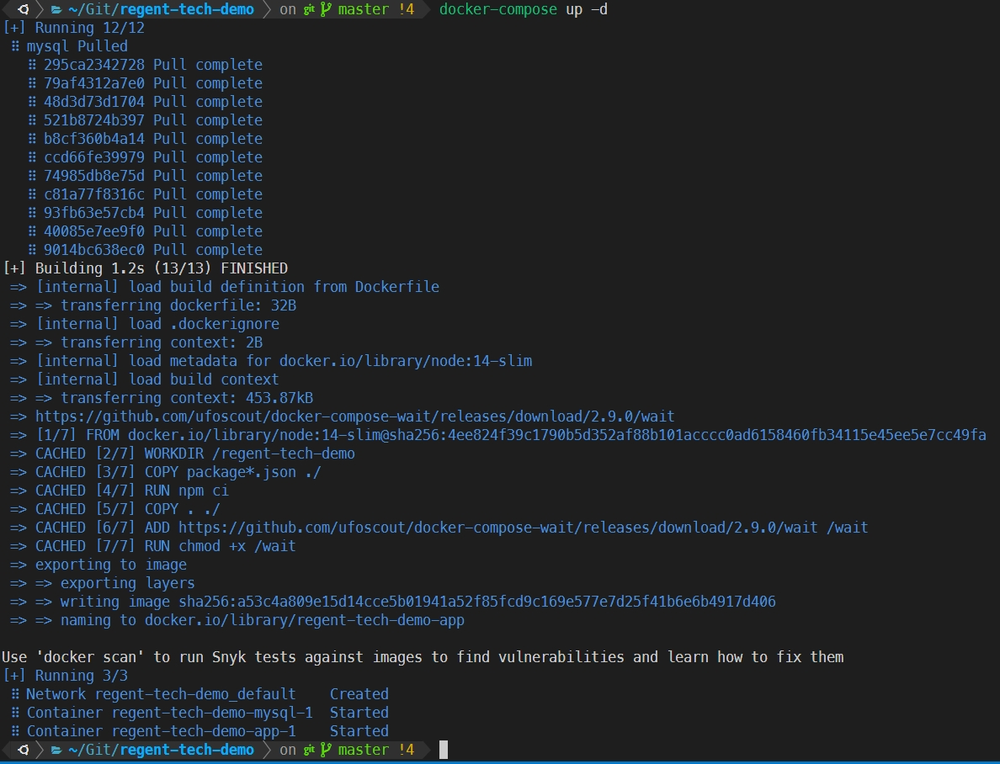

Now you can check the current working containers with `docker ps` and docker images with `docker images`:


### Stop the Application

Stopping all the running containers is also simple with a single command: `docker-compose down`

If you need to stop and remove all containers, networks, and all images used by any service in docker-compose.yml file, use the command: `docker-compose down --rmi all`


### Testing the API

We can use the [previous Postman examples](./screenshots/regent-tech-demo.postman_collection.json) to test our application, but just keep in mind that we need to change the port from `8080` to `6868` for all the requests; as we mentioned earlier, the host port is not the same as the container port.

### Conclusion

In this part we’ve successfully created a Docker Compose file for our MySQL and Node.js application. Now we can deploy our app with Docker in a very simple way: using our `docker-compose.yml` file.

## Unit testing overview

For this app, we're going to be writing 2 types of unit tests: one will test the Sequelize model we've created and one to test the Express server itself.

For this, we're going need to install the *mocha*, *chai* and *sequelize-test-helpers* modules: `npm i --save-dev mocha chai chai-http sequelize-test-helpers`, more about these later.

### Setting up Mocha

Mocha is perfect for this scenario as it works out-of-the-box and requires no additional configuration. Once we've installed the node module, all we need to do is create a script in `package.json` that we can use to run the unit tests:
```json
...
  "scripts": {
    "start": "node src/server.js",
    "test": "mocha"
  },
...
```
To stay organised, create a directory called `test` in the root of the application; this is where we're going to store our tests.

### Testing the Express server

We will start by creating a new file: `test/server.spec.js` and importing the required modules:

```js
const chai = require('chai')
const expect = chai.expect
const chaiHttp = require('chai-http')

chai.use(chaiHttp)
chai.should()
```

Don't be thrown off by the lack of mocha-related imports; mocha will take care of that automagically, the *chai* and *chai-http* assersion libraries are all we really need here.

Writing tests is actually quite simple thanks to natural naming conventions and thankfully we designed our app to be testable from the start by exporting our server in the `server.js` file, so we can just import it in our test and it will come with our entire Express configuration: `const server = require('../src/server')`

Next, we're going to be using the *describe-it-after* mocha hook syntax to format our tests. Here's what they will look like:
```js
describe('Server initialization', () => {
  it('Existing route should return 200', (done) => {
    chai
      .request(server)
      .get('/')
      .end((err, res) => {
        if (err) done(err)
        expect(res.status).to.equal(200)
        expect(res.text).to.equal('Welcome to our Regent tech demo 🎉🎉🎉')
        done()
      })
  })

  it('Unexistant route should return 404', (done) => {
    chai
      .request(server)
      .get('/randomNonexistingPathHere')
      .end((err, res) => {
        if (err) done(err)
        const { error } = res.body
        expect(res.status).to.equal(404)
        expect(error)
        expect(error).to.equal('Route not found')
        done()
      })
  })

  after(() => {
    server.close()
  })
})
```

The tests are pretty straightforward: we use *chai-http* to start our Express server and send 2 GET requests to it, one testing the default route and one testing the 404 route.
The use of the `done` callback is essential to asynchronous tests, such as those for database queries and API calls. 
As you can see, in the `after` hook we're going to close our server to prevent unwanted background processes and so that the tests finish successfully; tests also pass when they return, and fail when they throw an error. 

Executing this gives us the following:
- 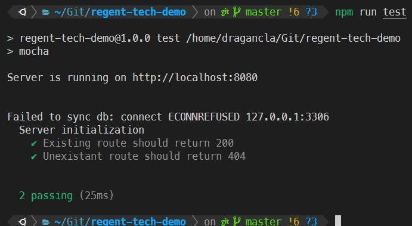

### Testing the Sequelize model

We will start by creating a new file: `test/model.spec.js`

Unit-testing Sequelize models efficiently, in isolation, such that you do not invoke a connection to the underlying database, presents a few challenges. That's why we're going to be using the *sequelize-test-helpers* node module. 

As soon as the app first calls the model, Sequelize gets invoked and that’s going to attempt to make a connection to the database. This is both slow and, if there is no database running, it is likely to cause connection errors.

In our tests we therefore want to completely avoid having to require the model at all. We can of focus the test on the specific model we want to test. But for that to be of use we need to pass it an instantiated sequelize object, and a Sequelize DataTypes object.

The *sequelize-test-helpers* library provides a mock sequelize instance and a complete set of sequelize data types:
```js
const {
  sequelize,
  dataTypes,
  checkModelName,
  checkPropertyExists,
  checkNonUniqueIndex,
} = require('sequelize-test-helpers')

const ConsultantsModel = require('../src/models/consultants.model')

describe('src/models/consultants.model', () => {
  const Model = ConsultantsModel(sequelize, dataTypes)
  const consultant = new Model()

  context('name', () => {
    checkModelName(Model)('consultant')
  })

  context('properties', () => {
    ['name', 'skills', 'assigned'].forEach(checkPropertyExists(consultant))
  })

  context('indexes', () => {
    ['name', 'assigned'].forEach(checkNonUniqueIndex(consultant))
  })
})
```
This tests that the model’s name is the name we expect, that the model has the properties we expect and that the indexes are what we expect.

Of course, we can use the *sequelize-test-helpers* library for a lot more than just the above (it can be used to test associations, hooks, code that relies on models etc.), but it's a good starting point for familiarizing ourselves with writing unit tests for *sequelize*. More information can be found in the module's [npmjs page](https://www.npmjs.com/package/sequelize-test-helpers).

Executing the tests now gives us the following:
- 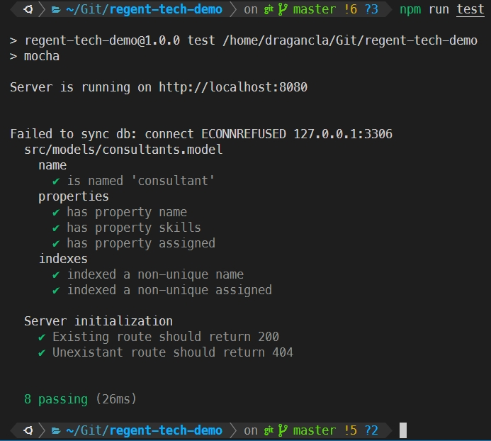

## Using Docker Compose in Azure DevOps pipeline

This section will showcase how to use docker-compose in Azure DevOps pipeline for building and publishing your containers to ACR (Azure Container Registry). Don't forget to push your code to the cloud, we're going to need it!

### Container Registry configuration

First things first, we need to go to [Azure Portal] and *Create Container Registry*. This will also automatically create a *Resource Group* for us as well. We will use the *Container Registry* to store the images we're going to build with Azure DevOps. 

- 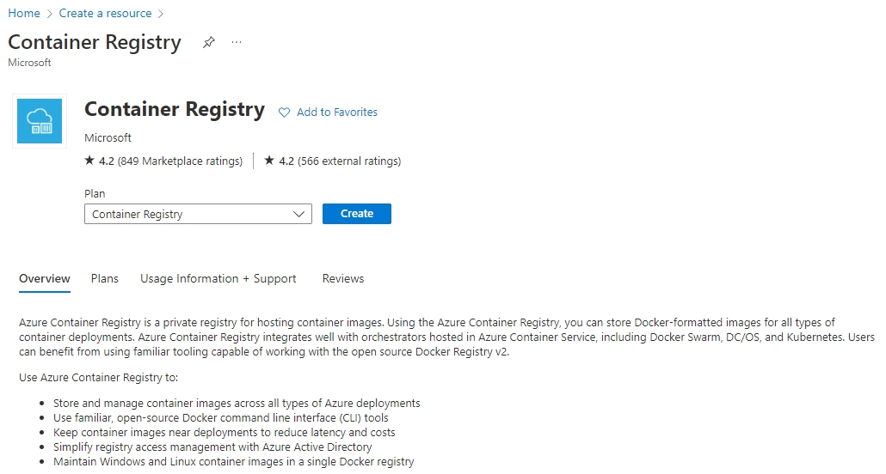 
- 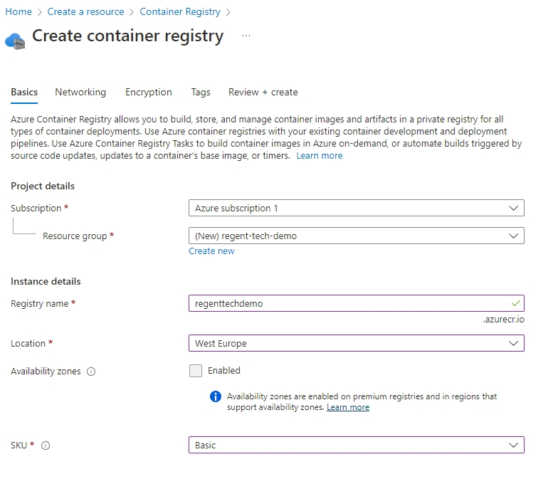 
-  

One little thing to note is that we need to enable the *Admin user* for the registry we just created once it's finished deploying. This is to allow Azure DevOps to push and read from it.

- 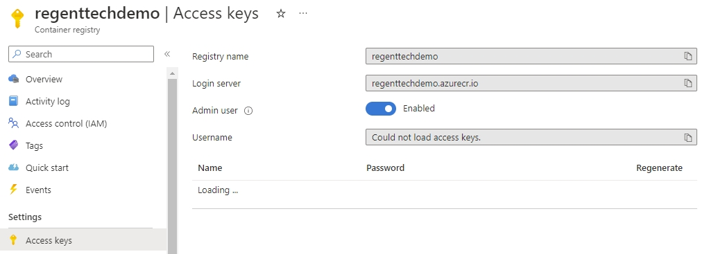 

### Azure DevOps Pipelines

Next we'll head over to [Azure DevOps] and select *Pipelines* and create a *New pipeline*.
- 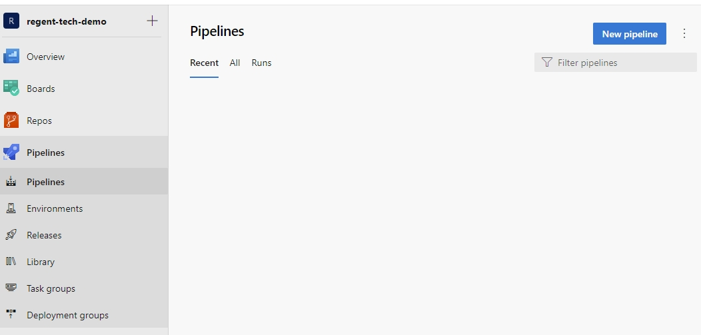 

Select *Azure Repos Git* or whatever version control system you've pushed your code to.
- 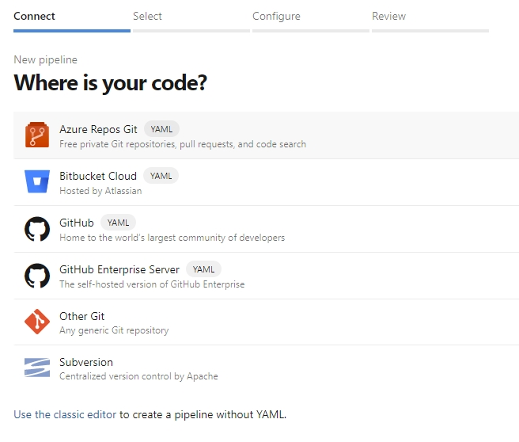 

Select your repository.
- 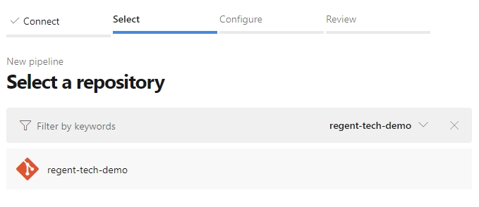 

Select the second *Docker* option.
- 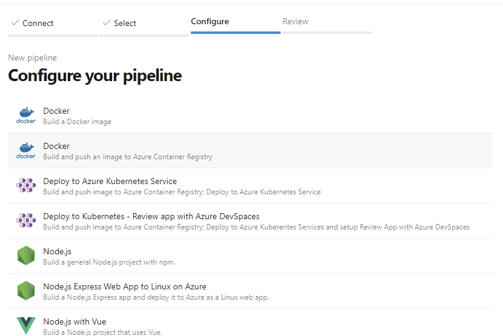 

Validate and configure your settings. Don't worry if it specifies a Dockerfile there instead of the `docker-compose.yml` file, this is just going to create a skeleton pipeline that we will replace with the correct docker-compose configuration later on.
- 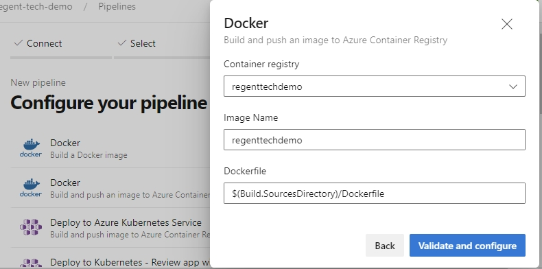 

Click on the *Show asssistant* button on the right side of the screen to pop up the *Tasks* menu.
- 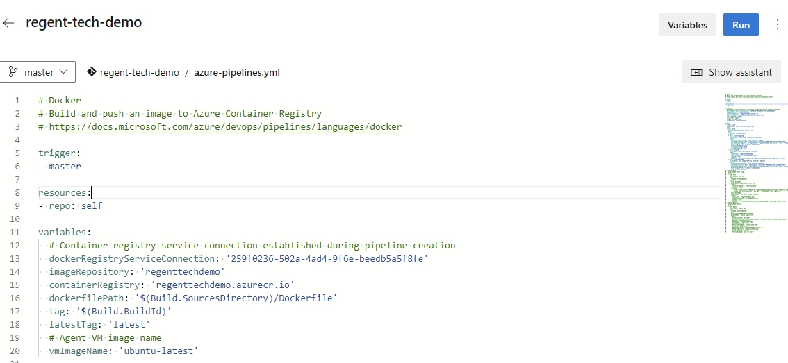 

Search for the Docker Compose task and select the first option.
- 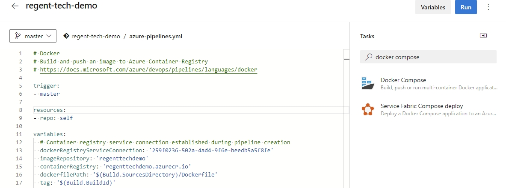 

Complete the mandatory fields. When it prompts you to select your *Azure subscription* make sure to select the *Service sonnections* and not the *Subscription* option; they may look identical but actually only one will work. Also make sure the path to the *docker-compose.yaml* file is correct; the default option works for us in this case.
- 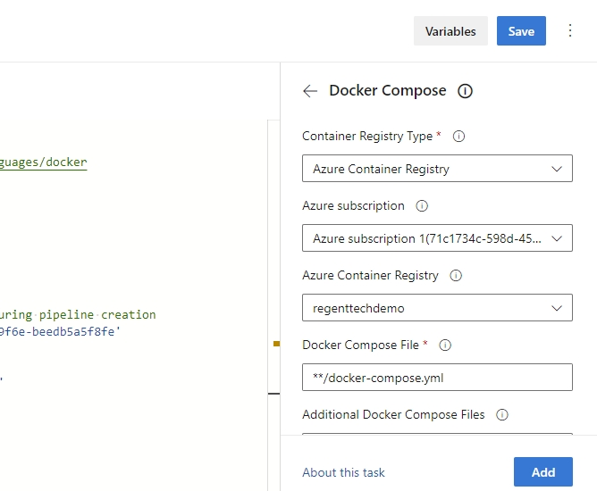 

Make sure the cursor for the editor on the left is on an empty line at the end of the file and click *Add*. It should automatically populate the *azure-pipelines.yaml* file editor with the correct pipeline configuration, albeit the indentation will be wrong. Moving it 2 tabs to the right will fix it. 

### Running tests in the pipeline

While replacing the default Docker configuration with this new docker-compose configuration will generally take care of building and pushing the image to ACR, we would like to also test our code before pushing the image to make sure it's a valid image. To do this, we're going to split the pipeline into 3 different steps:
1. Build the image
2. Run unit tests
3. Push the image to ACR 

Here is what the main pipeline code will look like:
```yaml
...
stages:
- stage: Build
  displayName: Build, test and push stage
  jobs:
  - job: Build
    displayName: Build test and push job
    pool:
      vmImage: $(vmImageName)
    steps:
    - task: DockerCompose@0
      displayName: Build image from Docker Container
      inputs:
        containerregistrytype: 'Azure Container Registry'
        azureSubscription: 'Azure subscription 1(71c1734c-598d-453b-ad3a-c306e837ec9f)'
        azureContainerRegistry: '{"loginServer":"regenttechdemo.azurecr.io", "id" : "/subscriptions/71c1734c-598d-453b-ad3a-c306e837ec9f/resourceGroups/regent-tech-demo/providers/Microsoft.ContainerRegistry/registries/regenttechdemo"}'
        dockerComposeFile: '**/docker-compose.yml'
        action: 'Build services'
        includeSourceTags: true
        includeLatestTag: true
    - task: Docker@2
      displayName: 'Run tests inside container'
      inputs:
        repository: 'regenttechdemo_app'
        containerRegistry: $(imageRepository)
        command: 'run'
        arguments: '$(containerRegistry)/regenttechdemo_app:$(latestTag) npm run test'
    - task: DockerCompose@0
      displayName: Push image to Azure Container Registry
      inputs:
        containerregistrytype: 'Azure Container Registry'
        azureSubscription: 'Azure subscription 1(71c1734c-598d-453b-ad3a-c306e837ec9f)'
        azureContainerRegistry: '{"loginServer":"regenttechdemo.azurecr.io", "id" : "/subscriptions/71c1734c-598d-453b-ad3a-c306e837ec9f/resourceGroups/regent-tech-demo/providers/Microsoft.ContainerRegistry/registries/regenttechdemo"}'
        dockerComposeFile: '**/docker-compose.yml'
        action: 'Push services'
```

Note that, while we're using `DockerCompose@0` tasks to build and push the image, we're using a `Docker@2` task to start and run commands within the container (in this case, tests).

When you feel happy with the pipeline, clicking on *Save and run* should automatically commit the *azure-pipelines.yaml* file to your repository's root directory and start building the application.

### Checking the results 

To check the build status and output we will again head over to [Azure DevOps] and select *Pipelines*.
-  

Clicking on the recently-created pipeline and on the automatically started run will send us to a *Summary* of the run where we can easily check the build status.
- 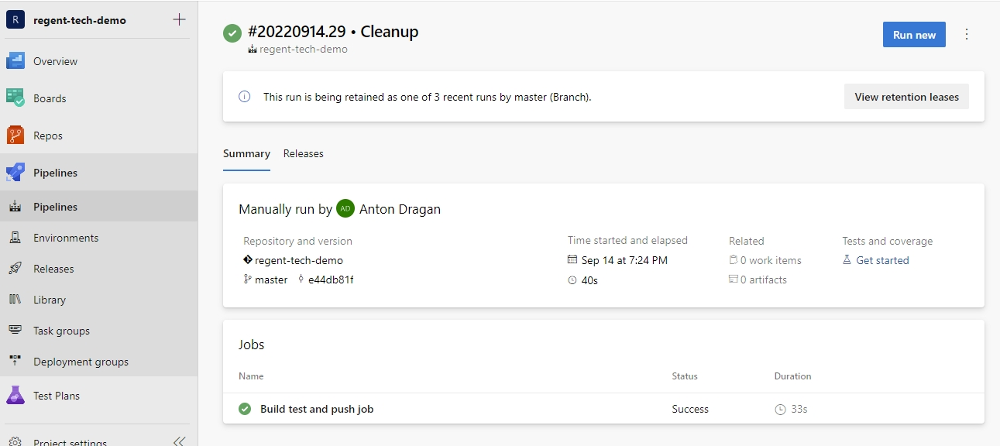 

Clicking on the job on the bottom will allow us to see the build output. Here we can see the 3 steps we have created earlier.
- 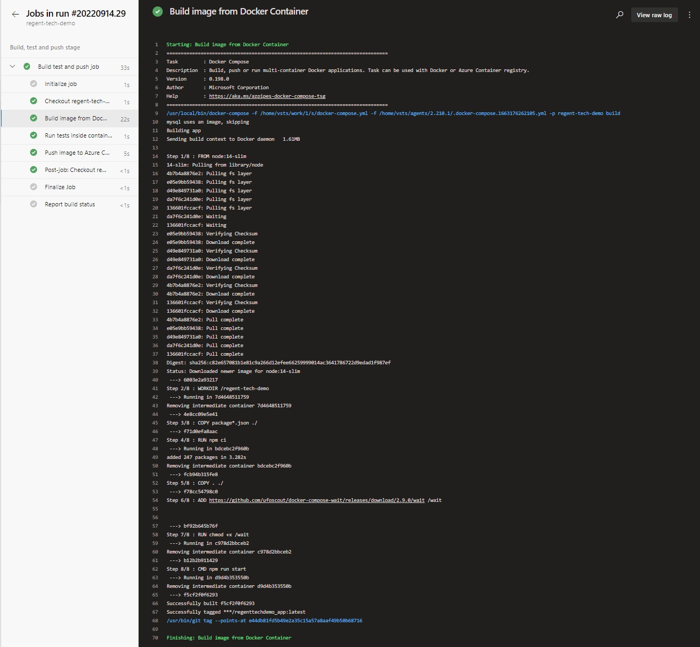 
- 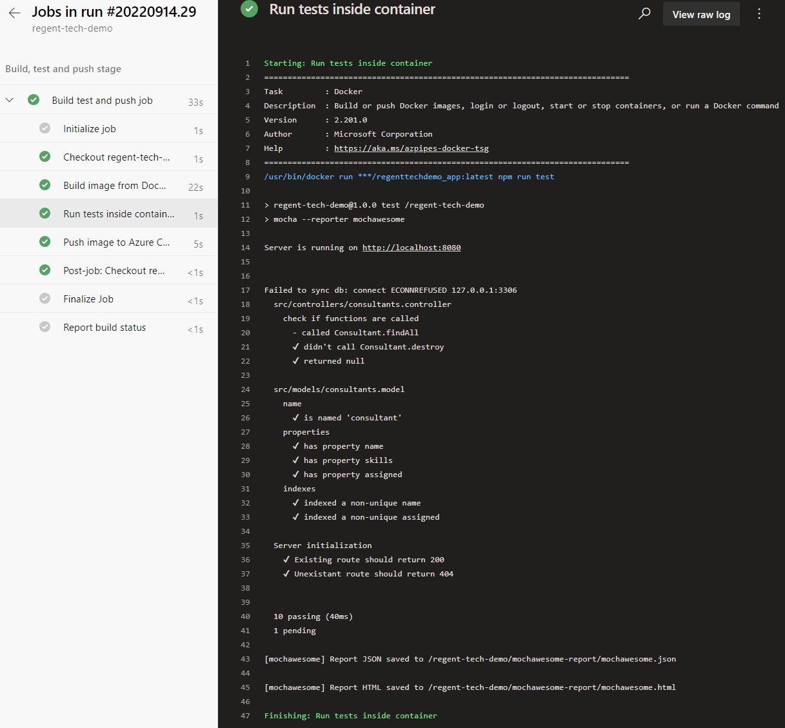 
- 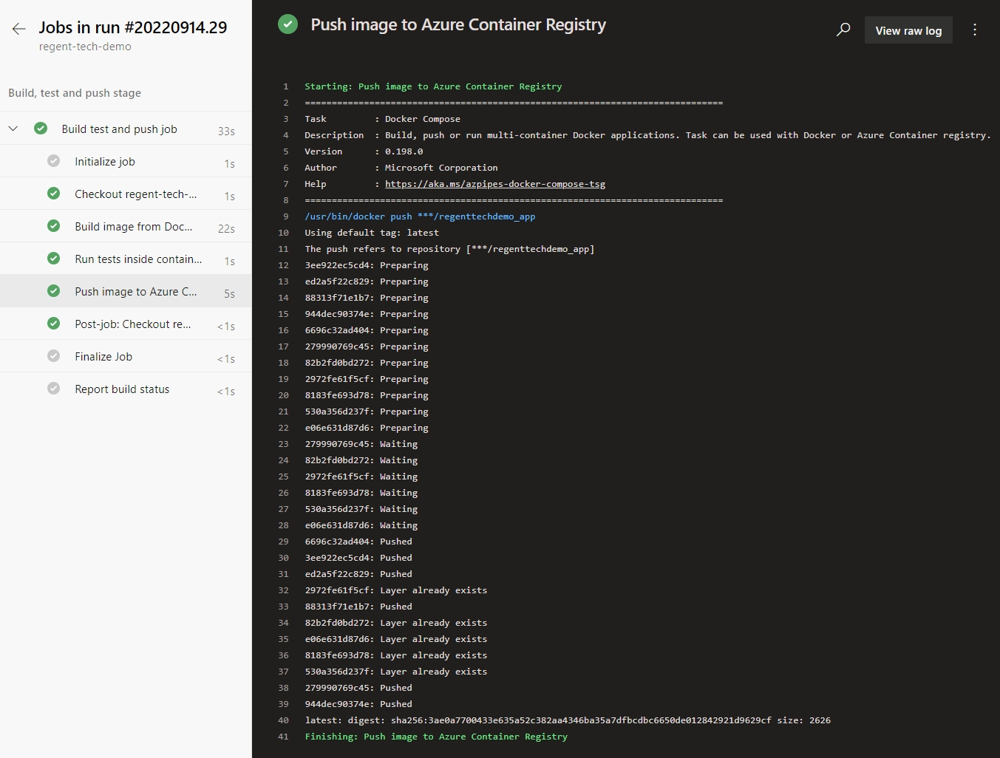 

## Conclusion

Hope this tech demo helped provide a basic understanding over how to create, test and build an application using Microsoft's Azure platform and tooling. 

Happy coding!

[git-repo-url]: <https://dev.azure.com/antondragan/_git/regent-tech-demo>
[Anton Dragan]: <http://antondragan.com>
[node.js]: <http://nodejs.org>
[express]: <http://expressjs.com>
[mysql]: <https://www.mysql.com>
[chai]: <https://www.chaijs.com>
[mocha]: <https://mochajs.org>
[docker]: <https://www.docker.com>
[docker-compose]: <https://github.com/docker/compose>
[sequelize]: <https://sequelize.org>
[azure devops]: <https://dev.azure.com>
[azure portal]: <https://portal.azure.com>
[this guide]: <https://docs.docker.com/desktop/windows/wsl/#download>
